# 常见的JavaScript内存泄露


## 什么是内存泄露
> **内存泄漏**指由于疏忽或错误造成程序未能释放已经不再使用的内存。内存泄漏并非指内存在物理上的消失，而是应用程序分配某段内存后，由于设计错误，导致在释放该段内存之前就失去了对该段内存的控制，从而造成了内存的浪费。
>内存泄漏通常情况下只能由获得程序源代码的程序员才能分析出来。然而，有不少人习惯于把任何不需要的内存使用的增加描述为内存泄漏，即使严格意义上来说这是不准确的。
————[wikipedia](https://zh.wikipedia.org/wiki/%E5%86%85%E5%AD%98%E6%B3%84%E6%BC%8F)


## 意外的全局变量

JavaScript对未声明变量的处理方式：在全局对象上创建该变量的引用(即全局对象上的属性，不是变量，因为它能通过`delete`删除)。如果在浏览器中，全局对象就是**window**对象。

如果未声明的变量缓存大量的数据，会导致这些数据只有在窗口关闭或重新刷新页面时才能被释放。这样会造成意外的内存泄漏。

```js
function foo(arg) {
    bar = "this is a hidden global variable with a large of data";
}
```
等同于：
```js
function foo(arg) {
    window.bar = "this is an explicit global variable with a large of data";
}
```

另外，通过**this**创建意外的全局变量：

```js
function foo() {
    this.variable = "potential accidental global";
}

// 当在全局作用域中调用foo函数，此时this指向的是全局对象(window)，而不是'undefined'
foo();
```
### 解决方法：
在JavaScript文件中添加`'use strict'`，开启严格模式，可以有效地避免上述问题。
```js
function foo(arg) {
    "use strict" // 在foo函数作用域内开启严格模式
    bar = "this is an explicit global variable with a large of data";// 报错：因为bar还没有声明
}
```
如果需要在一个函数中使用全局变量，可以像如下代码所示，在**window**上明确声明：
```js
function foo(arg) {
    window.bar = "this is a explicit global variable with a large of data";
}
```
这样不仅可读性高，而且后期维护也方便

> 谈到全局变量，需要注意那些用来临时存储大量数据的全局变量，确保在处理完这些数据后将其设置为null或重新赋值。全局变量也常用来做cache，一般cache都是为了性能优化才用到的，为了性能，最好对cache的大小做个上限限制。因为cache是不能被回收的，越高cache会导致越高的内存消耗。

## console.log

`console.log`：向web开发控制台打印一条消息，常用来在开发时调试分析。有时在开发时，需要打印一些对象信息，但发布时却忘记去掉`console.log`语句，这可能造成内存泄露。

在传递给`console.log`的对象是不能被垃圾回收 ♻️，因为在代码运行之后需要在开发工具能查看对象信息。所以最好不要在生产环境中`console.log`任何对象。

### 实例------>[demos/log.html](./demos/log.html)
```html
<!DOCTYPE html>
<html lang="en">

<head>
  <meta charset="UTF-8">
  <meta name="viewport" content="width=device-width, initial-scale=1.0">
  <meta http-equiv="X-UA-Compatible" content="ie=edge">
  <title>Leaker</title>
</head>

<body>
  <input type="button" value="click">
  <script>
    !function () {
      function Leaker() {
        this.init();
      };
      Leaker.prototype = {
        init: function () {
          this.name = (Array(100000)).join('*');
          console.log("Leaking an object %o: %o", (new Date()), this);// this对象不能被回收
        },

        destroy: function () {
          // do something....
        }
      };
      document.querySelector('input').addEventListener('click', function () {
        new Leaker();
      }, false);
    }()
  </script>
</body>

</html>
```
这里结合Devtools–>Performance做一些分析，操作步骤如下：

<u>**注：最好在隐藏窗口中进行分析工作，避免浏览器插件影响分析结果**</u>

1. 开启Performance项的记录
2. 执行一次CG，创建基准参考线
3. 连续单击【click】按钮三次，新建三个Leaker对象
4. 执行一次CG
5. 停止记录


可以看出【JS Heap】线最后没有降回到基准参考线的位置，显然存在没有被回收的内存。如果将代码修改为：

```js
    !function () {
      function Leaker() {
        this.init();
      };
      Leaker.prototype = {
        init: function () {
          this.name = (Array(100000)).join('*');
        },

        destroy: function () {
          // do something....
        }
      };
      document.querySelector('input').addEventListener('click', function () {
        new Leaker();
      }, false);
    }()
```
去掉`console.log("Leaking an object %o: %o", (new Date()), this);`语句。重复上述的操作步骤，分析结果如下：


从对比分析结果可知，`console.log`打印的对象是不会被垃圾回收器回收的。因此最好不要在页面中`console.log`任何大对象，这样可能会影响页面的整体性能，特别在生产环境中。除了`console.log`外，另外还有`console.dir`、`console.error`、`console.warn`等都存在类似的问题，这些细节需要特别的关注。


## closures(闭包)
当一个函数A返回一个内联函数B，即使函数A执行完，函数B也能访问函数A作用域内的变量，这就是一个闭包——————本质上闭包是将函数内部和外部连接起来的一座桥梁。

```js
function foo(message) {
    function closure() {
        console.log(message)
    };
    return closure;
}

// 使用
var bar = foo("hello closure!");
bar()// 返回 'hello closure!'
```
在函数foo内创建的函数closure对象是不能被回收掉的，因为它被全局变量bar引用，处于一直可访问状态。通过执行`bar()`可以打印出`hello closure!`。如果想释放掉可以将`bar = null`即可。

<u>**由于闭包会携带包含它的函数的作用域，因此会比其他函数占用更多的内存。过度使用闭包可能会导致内存占用过多。**</u>

### 实例------>[demos/closures.html](./demos/closures.html)

```html
<!DOCTYPE html>
<html lang="en">

<head>
  <meta charset="UTF-8">
  <meta name="viewport" content="width=device-width, initial-scale=1.0">
  <meta http-equiv="X-UA-Compatible" content="ie=edge">
  <title>Closure</title>
</head>

<body>
  <p>不断单击【click】按钮</p>
  <button id="click_button">Click</button>
  <script>
    function f() {
      var str = Array(10000).join('#');
      var foo = {
        name: 'foo'
      }
      function unused() {
        var message = 'it is only a test message';
        str = 'unused: ' + str;
      }
      function getData() {
        return 'data';
      }
      return getData;
    }

    var list = [];
    
    document.querySelector('#click_button').addEventListener('click', function () {
      list.push(f());
    }, false);
  </script>
</body>

</html>
```
这里结合Chrome的Devtools->Memory工具进行分析，操作步骤如下：

<u>**注：最好在隐藏窗口中进行分析工作，避免浏览器插件影响分析结果**</u>

1. 选中【Record allocation timeline】选项
2. 执行一次CG
3. 单击【start】按钮开始记录堆分析
3. 连续单击【click】按钮十多次
4. 停止记录堆分析

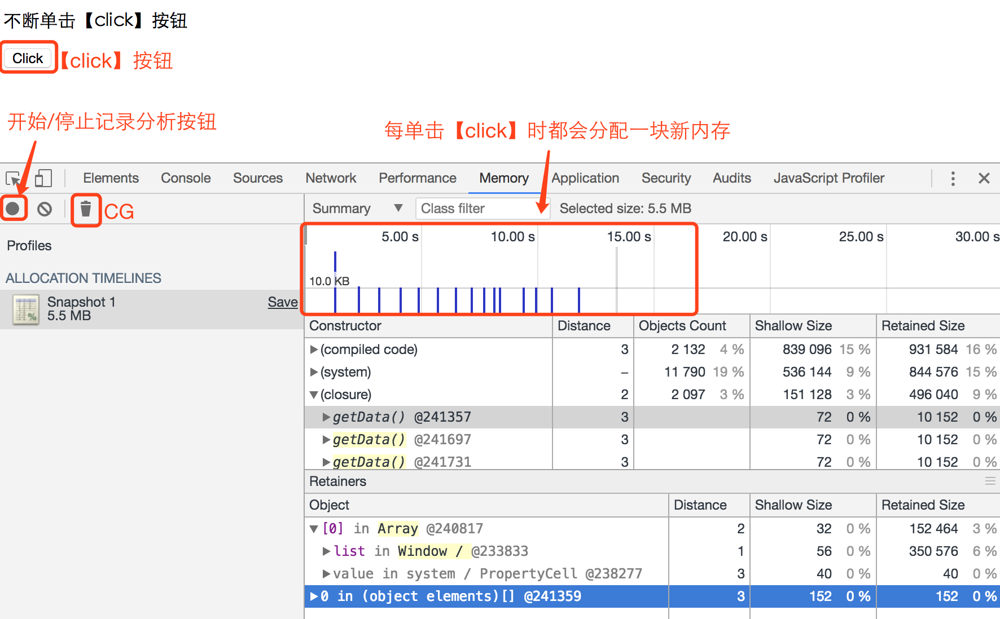

上图中蓝色柱形条表示随着时间新分配的内存。选中其中某条蓝色柱形条，过滤出对应新分配的对象：

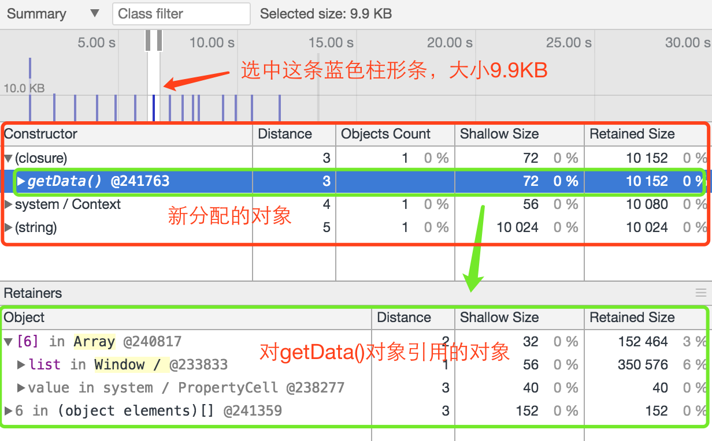

查看对象的详细信息：

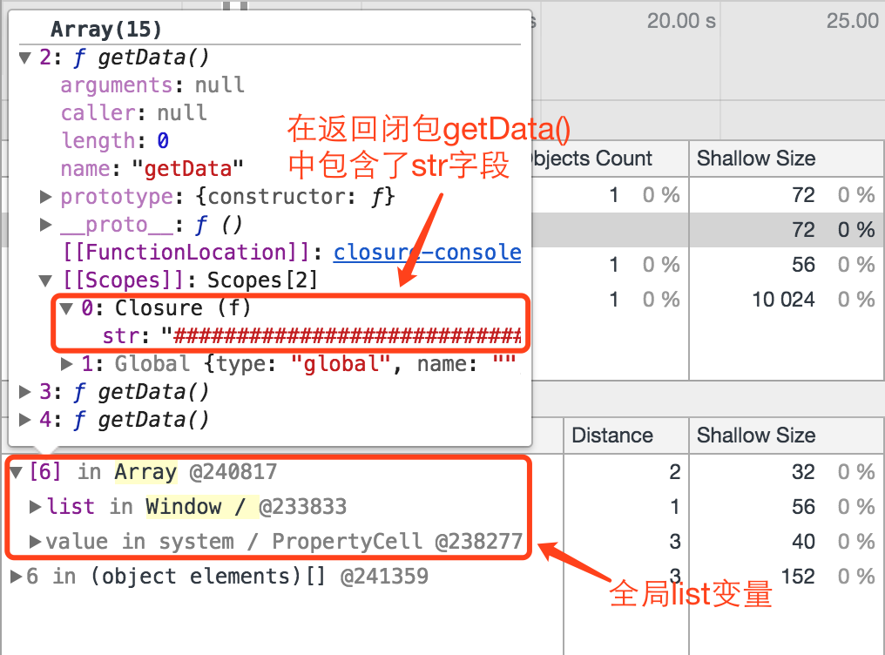

从图可知，在返回的闭包作用链(Scopes)中携带有它所在函数的作用域，作用域中还包含一个str字段。而str字段并没有在返回getData()中使用过。为什么会存在在作用域中，按理应该被GC回收掉的？

原因是在相同作用域内创建的多个内部函数对象是共享同一个[变量对象（variable object）](http://dmitrysoshnikov.com/ecmascript/chapter-2-variable-object/)。如果创建的内部函数没有被其他对象引用，不管内部函数是否引用外部函数的变量和函数，在外部函数执行完，对应变量对象便会被销毁。反之，如果内部函数中存在有对外部函数变量或函数的访问（可以不是被引用的内部函数），并且存在某个或多个内部函数被其他对象引用，那么就会形成闭包，外部函数的变量对象就会存在于闭包函数的作用域链中。这样确保了闭包函数有权访问外部函数的所有变量和函数。了解了问题产生的原因，便可以对症下药了。对代码做如下修改：

```js
    function f() {
      var str = Array(10000).join('#');
      var foo = {
        name: 'foo'
      }
      function unused() {
        var message = 'it is only a test message';
        // str = 'unused: ' + str; //删除该条语句
      }
      function getData() {
        return 'data';
      }
      return getData;
    }

    var list = [];
    
    document.querySelector('#click_button').addEventListener('click', function () {
      list.push(f());
    }, false);
```

getData()和unused()内部函数共享f函数对应的变量对象，因为unused()内部函数访问了f作用域内str变量，所以str字段存在于f变量对象中。加上getData()内部函数被返回，被其他对象引用，形成了闭包，因此对应的f变量对象存在于闭包函数的作用域链中。这里只要将函数unused中`str = 'unused: ' + str;`语句删除便可解决问题。

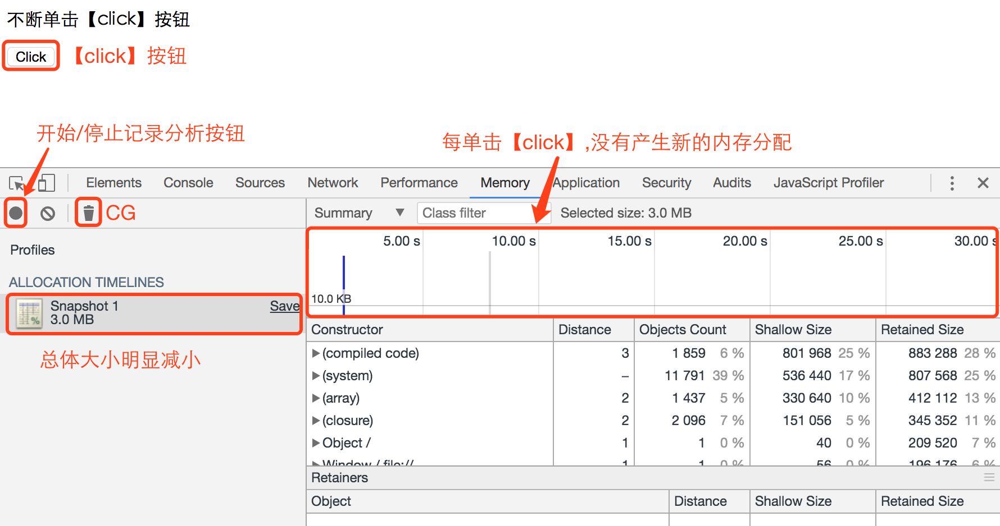

查看一下闭包信息：

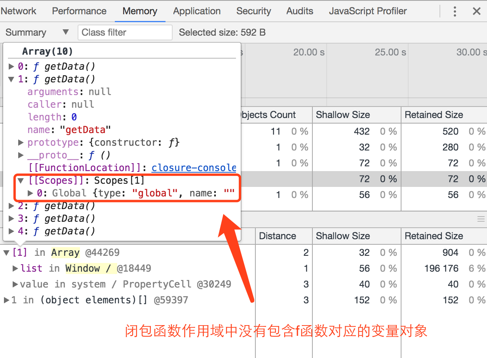

## DOM泄露

在JavaScript中，DOM操作是非常耗时的。因为JavaScript/ECMAScript引擎独立于渲染引擎，而DOM是位于渲染引擎，相互访问需要消耗一定的资源。如Chrome浏览器中DOM位于WebCore，而JavaScript/ECMAScript位于V8中。假如将JavaScript/ECMAScript、DOM分别想象成两座孤岛，两岛之间通过一座收费桥连接，过桥需要交纳一定“过桥费”。JavaScript/ECMAScript每次访问DOM时，都需要交纳“过桥费”。因此访问DOM次数越多，费用越高，页面性能就会受到很大影响。[了解更多:information_source:](http://www.phpied.com/dom-access-optimization/)


为了减少DOM访问次数，一般情况下，当需要多次访问同一个DOM方法或属性时，会将DOM引用缓存到一个局部变量中。<u>但如果在执行某些删除、更新操作后，可能会忘记释放掉代码中对应的DOM引用，这样会造成DOM内存泄露。</u>

### 实例------>[demos/dom.html](./demos/dom.html)

```html
<!DOCTYPE html>
<html lang="en">
<head>
  <meta charset="UTF-8">
  <meta name="viewport" content="width=device-width, initial-scale=1.0">
  <meta http-equiv="X-UA-Compatible" content="ie=edge">
  <title>Dom-Leakage</title>
</head>
<body>
  <input type="button" value="remove" class="remove">
  <input type="button" value="add" class="add">

  <div class="container">
    <pre class="wrapper"></pre>
  </div>
  <script>
    // 因为要多次用到<pre>节点，将其缓存到本地变量wrapper中，
    var wrapper = document.querySelector('.wrapper');
    var counter = 0;

    document.querySelector('.remove').addEventListener('click', function () {
      document.querySelector('.container').removeChild(wrapper);
    }, false);

    document.querySelector('.add').addEventListener('click', function () {
      wrapper.appendChild(document.createTextNode('\t' + ++counter + '：a new line text\n'));
    }, false);
  </script>
</body>
</html>
```
这里结合Chrome浏览器的Devtools–>Performance做一些分析，操作步骤如下：

<u>**注：最好在隐藏窗口中进行分析工作，避免浏览器插件影响分析结果**</u>

1. 开启Performance项的记录
2. 执行一次CG，创建基准参考线
3. 连续单击【add】按钮6次，增加6个文本节点到pre元素中
4. 单击【remove】按钮，删除刚增加6个文本节点和pre元元素
5. 执行一次CG
6. 停止记录堆分析

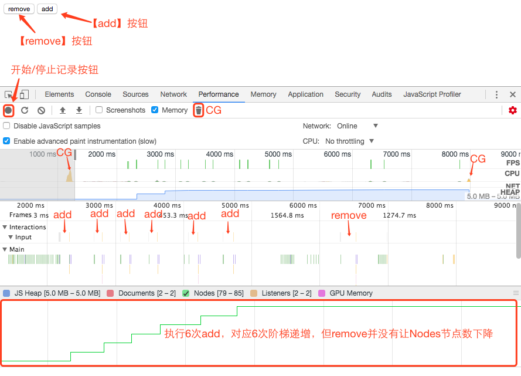

从分析结果图可知，虽然6次add操作增加6个Node，但是remove操作并没有让Nodes节点数下降，即remove操作失败。尽管还主动执行了一次CG操作，Nodes曲线也没有下降。因此可以断定内存泄露了！那问题来了，如何去查找问题的原因呢？这里可以通过Chrome浏览器的Devtools–>Memory进行诊断分析，执行如下操作步骤：

<u>**注：最好在隐藏窗口中进行分析工作，避免浏览器插件影响分析结果**</u>

1. 选中【Take heap snapshot】选项
2. 连续单击【add】按钮6次，增加6个文本节点到pre元素中
3. 单击【Take snapshot】按钮，执行一次堆快照
4. 单击【remove】按钮，删除刚增加6个文本节点和pre元元素
5. 单击【Take snapshot】按钮，执行一次堆快照
6. 选中生成的第二个快照报告，并将视图由"Summary"切换到"Comparison"对比模式，在[class filter]过滤输入框中输入关键字Detached

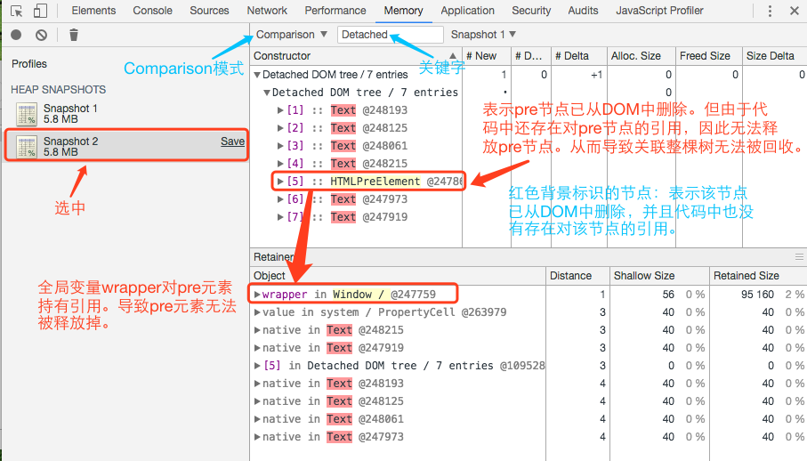

从分析结果图可知，导致整个pre元素和6个文本节点无法别回收的原因是：代码中存在全局变量`wrapper`对pre元素的引用。知道了产生的问题原因，便可对症下药了。对代码做如下就修改：

```js
    // 因为要多次用到<pre>节点，将其缓存到本地变量wrapper中，
    var wrapper = document.querySelector('.wrapper');
    var counter = 0;

    document.querySelector('.remove').addEventListener('click', function () {
      document.querySelector('.container').removeChild(wrapper);
      wrapper = null;//在执行删除操作时，将wrapper对pre节点的引用释放掉
    }, false);

    document.querySelector('.add').addEventListener('click', function () {
      wrapper.appendChild(document.createTextNode('\t' + ++counter + '：a new line text\n'));
    }, false);
```
在执行删除操作时，将wrapper对pre节点的引用释放掉，即在删除逻辑中增加`wrapper = null;`语句。再次在Devtools–>Performance中重复上述操作：

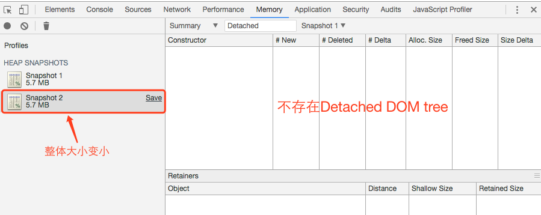

### 小试牛刀------>[demos/dom_practice.html](./demos/dom_practice.html)

再来看看网上的一个实例，代码如下：

```html
<!DOCTYPE html>
<html lang="en">
<head>
  <meta charset="UTF-8">
  <meta name="viewport" content="width=device-width, initial-scale=1.0">
  <meta http-equiv="X-UA-Compatible" content="ie=edge">
  <title>Practice</title>
</head>
<body>
  <div id="refA"><ul><li><a href="#"></a></li><li><a href="#"></a></li><li><a href="#" id="refB"></a></li></ul></div>
  <div></div>
  <div></div>

  <script>
    var refA = document.getElementById('refA');
    var refB = document.getElementById('refB');
    document.body.removeChild(refA);

    // #refA不能GC回收，因为存在变量refA对它的引用。将其对#refA引用释放，但还是无法回收#refA。
    refA = null;

    // 还存在变量refB对#refB的间接引用(refB引用了#refB，而#refB属于#refA)。将变量refB对#refB的引用释放，refA就可以被GC回收。
    refB = null;
  </script>
</body>
</html>
```

整个过程如下图所演示：

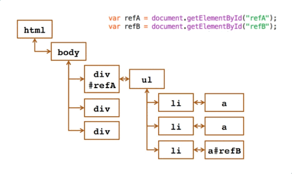

有兴趣的同学可以使用Chrome的Devtools工具，验证一下分析结果，实践很重要~~~


## 被遗忘的timers和callbacks

### timers

在JavaScript常用`setInterval()`来实现一些动画效果。当然也可以使用链式`setTimeout()`调用模式来实现：

```js
setTimeout(function() {
  // do something. . . .
  setTimeout(arguments.callee, interval);
}, interval);
```

如果在不需要`setInterval()`时，没有通过`clearInterval()`方法移除，那么`setInterval()`会不停地调用函数，直到调用`clearInterval()`或窗口关闭。如果链式`setTimeout()`调用模式没有给出终止逻辑，也会一直运行下去。因此再不需要重复定时器时，确保对定时器进行清除，避免占用系统资源。另外，在使用`setInterval()`和`setTimeout()`来实现动画时，无法确保定时器按照指定的时间间隔来执行动画。为了能在JavaScript中创建出平滑流畅的动画，浏览器为JavaScript动画添加了一个新API-requestAnimationFrame()。[关于setInterval、setTimeout与requestAnimationFrame实现动画上的区别➹猛击😊](http://123fe.cn/2017/11/23/requestAnimationFrame/)

#### 实例------>[demos/timers.html](./demos/timers.html)

如下通过`setInterval()`实现一个clock的小实例，不过代码存在问题的，有兴趣的同学可以先尝试找一下问题的所在~~~~~😎
操作：

- 单击【start】按钮开始clock，同时web开发控制台会打印实时信息
- 单击【stop】按钮停止clock，同时web开发控制台会输出停止信息

```html
<!DOCTYPE html>
<html lang="en">
<head>
  <meta charset="UTF-8">
  <meta name="viewport" content="width=device-width, initial-scale=1.0">
  <meta http-equiv="X-UA-Compatible" content="ie=edge">
  <title>setInterval</title>
</head>
<body>
  <input type="button" value="start" class="start">
  <input type="button" value="stop" class="stop">

  <script>
    var counter = 0;
    var clock = {
      start: function () {
        setInterval(this.step.bind(null, ++counter), 1000);
      },
      step: function (flag) {
        var date = new Date();
        var h = date.getHours();
        var m = date.getMinutes();
        var s = date.getSeconds();
        console.log("%d-----> %d:%d:%d", flag, h, m, s);
      }
    }
    document.querySelector('.start').addEventListener('click', clock.start.bind(clock), false);
    document.querySelector('.stop').addEventListener('click', function () {
      console.log('----> stop <----');
      clock = null;
    }, false);
  </script>
</body>
</html>
```
上述代码存在两个问题：
 
 1. 如果不断的单击【start】按钮，会断生成新的clock。

 2. 单击【stop】按钮不能停止clock。

输出结果:

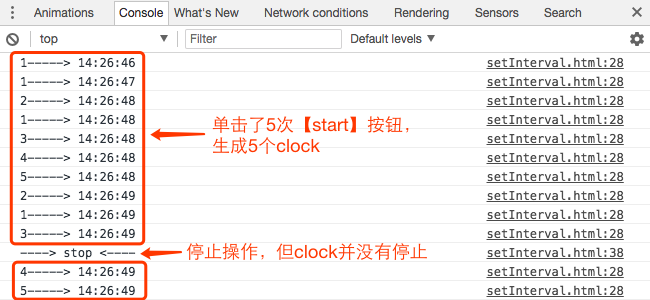

针对暴露出的问题，对代码做如下修改：

```js
    var counter = 0;
    var clock = {
      timer: null,
      start: function () {
        // 解决第一个问题
        if (this.timer) {
          clearInterval(this.timer);
        }
        this.timer = setInterval(this.step.bind(null, ++counter), 1000);
      },
      step: function (flag) {
        var date = new Date();
        var h = date.getHours();
        var m = date.getMinutes();
        var s = date.getSeconds();
        console.log("%d-----> %d:%d:%d", flag, h, m, s);
      },
      // 解决第二个问题
      destroy: function () {
        console.log('----> stop <----');
        clearInterval(this.timer);
        node = null;
        counter = void(0);
      }
    }
    document.querySelector('.start').addEventListener('click', clock.start.bind(clock), false);
    document.querySelector('.stop').addEventListener('click', clock.destroy.bind(clock), false);
```

### callbacks

做移动开发时，需要对不同设备尺寸做适配。如在开发组件时，有时需要考虑处理横竖屏适配问题。一般做法，在横竖屏发生变化时，需要将组件销毁后再重新生成。而在组件中会对其进行相关事件绑定，如果在销毁组件时，没有将组件的事件解绑，在横竖屏发生变化时，就会不断地对组件进行事件绑定。这样会导致一些异常，甚至可能会导致页面崩掉。

#### 实例------>[demos/callbacks.html](./demos/callbacks.html)

```html
<!DOCTYPE html>
<html lang="en">
<head>
  <meta charset="UTF-8">
  <meta name="viewport" content="width=device-width, initial-scale=1.0">
  <meta http-equiv="X-UA-Compatible" content="ie=edge">
  <title>callbacks</title>
</head>
<body>
  <div class="container"></div>
  <script>
    var container = document.querySelector('.container');
    var counter = 0;
    var createHtml = function (n, counter) {
      var template = `${(new Array(n)).join(`<div>${counter}: this is a new data <input type="button" value="remove"></div>`)}`
      container.innerHTML = template;
    }
   
    var resizeCallback = function (init) {
      createHtml(10, ++counter);
      // 事件委托
      container.addEventListener('click', function (event){
        var target = event.target;
          if(target.tagName === 'INPUT'){
              container.removeChild(target.parentElement)
          }
      }, false);   
    }
    window.addEventListener('resize', resizeCallback, false);
    resizeCallback(true);
  </script>
</body>
</html>
```
页面是存在问题的，这里结合Devtools–>Performance分析一下问题所在，操作步骤如下：

<u>**注：最好在隐藏窗口中进行分析工作，避免浏览器插件影响分析结果**</u>

1. 开启Performance项的记录
2. 执行一次CG，创建基准参考线
3. 对窗口大小进行调整
4. 执行一次CG
5. 停止记录

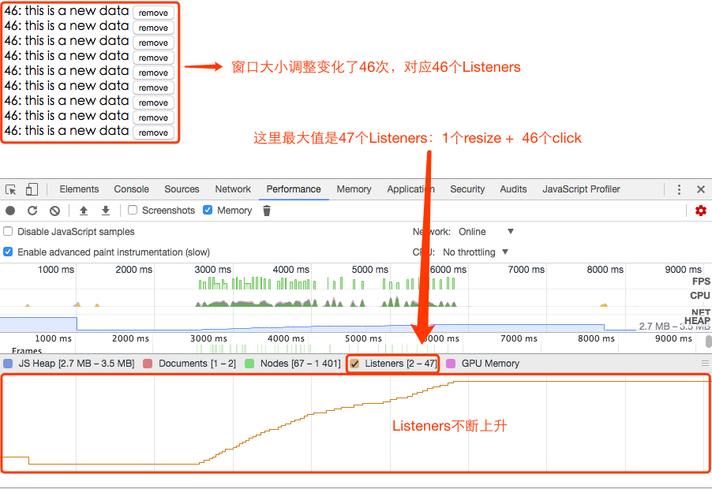

如分析结果所示，在窗口大小变化时，会不断地对`container`添加代理事件。

同一个元素节点注册了多个相同的EventListener，那么重复的实例会被抛弃。这么做不会让得EventListener被重复调用，也不需要用removeEventListener手动清除多余的EventListener，因为重复的都被自动抛弃了。而这条规则只是针对于命名函数。[对于匿名函数，浏览器会将其看做不同的EventListener](https://triangle717.wordpress.com/2015/12/14/js-avoid-duplicate-listeners/)，所以只要将匿名的EventListener，命名一下就可以解决问题：

```js
    var container = document.querySelector('.container');
    var counter = 0;
    var createHtml = function (n, counter) {
      var template = `${(new Array(n)).join(`<div>${counter}: this is a new data <input type="button" value="remove"></div>`)}`
      container.innerHTML = template;
    }
    // 
    var clickCallback = function (event) {
      var target = event.target;
      if (target.tagName === 'INPUT') {
        container.removeChild(target.parentElement)
      }
    }
    var resizeCallback = function (init) {
      createHtml(10, ++counter);
      // 事件委托
      container.addEventListener('click', clickCallback, false);
    }
    window.addEventListener('resize', resizeCallback, false);
    resizeCallback(true);
```
在Devtools–>Performance中再重复上述操作，分析结果如下：


在开发中，开发者很少关注事件解绑，因为浏览器已经为我们处理得很好了。不过在使用第三方库时，需要特别注意，因为一般第三方库都实现了自己的事件绑定，如果在使用过程中，在需要销毁事件绑定时，没有调用所解绑方法，就可能造成事件绑定数量的不断增加。如下链接是我在项目中使用jquery，遇见到类似问题：[jQuery中忘记解绑注册的事件，造成内存泄露➹猛击😊](http://123fe.cn/2017/11/01/%E5%86%85%E5%AD%98%E6%B3%84%E9%9C%B2%E4%B9%8BListeners/)


## 总结

本文主要介绍了几种常见的内存泄露。在开发过程，需要我们特别留意一下本文所涉及到的几种内存泄露问题。因为这些随时可能发生在我们日常开发中，如果我们对它们不了解是很难发现它们的存在。可能在它们将问题影响程度放大时，才会引起我们的关注。不过那时可能就晚了，因为产品可能已经上线，接着就会严重影响产品的质量和用户体验，甚至可能让我们承受大量用户流失的损失。作为开发我们必须把好这个关，让我们开发的产品带给用户最好的体验。


## 参考文章：
- [Circular Memory Leak Mitigation](https://msdn.microsoft.com/en-us/library/dd361842(v=vs.85).aspx)
- [DOM: why is this a memory leak?](https://stackoverflow.com/questions/15761094/dom-why-is-this-a-memory-leak)
- [Internet Explorer Event Handler Leaks](http://www.reigndropsfall.net/2011/01/05/internet-explorer-event-handler-leaks/)
- [Avoiding leaks in JavaScript XPCOM components](https://developer.mozilla.org/en-US/docs/Mozilla/Tech/XPCOM/Guide/Avoiding_leaks_in_JavaScript_components)
- [JScript Memory Leaks](http://www.crockford.com/javascript/memory/leak.html)
- [An interesting kind of JavaScript memory leak](https://blog.meteor.com/an-interesting-kind-of-javascript-memory-leak-8b47d2e7f156)
- [Memory Leaks in Microsoft Internet Explorer](http://isaacschlueter.com/2006/10/msie-memory-leaks/trackback/index.html)
- [Memory leak when logging complex objects](https://stackoverflow.com/questions/12996129/memory-leak-when-logging-complex-objects)